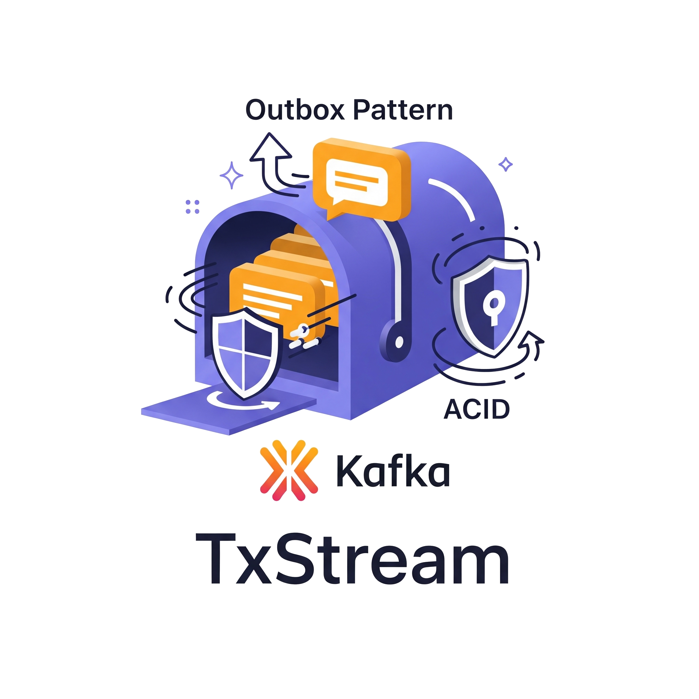
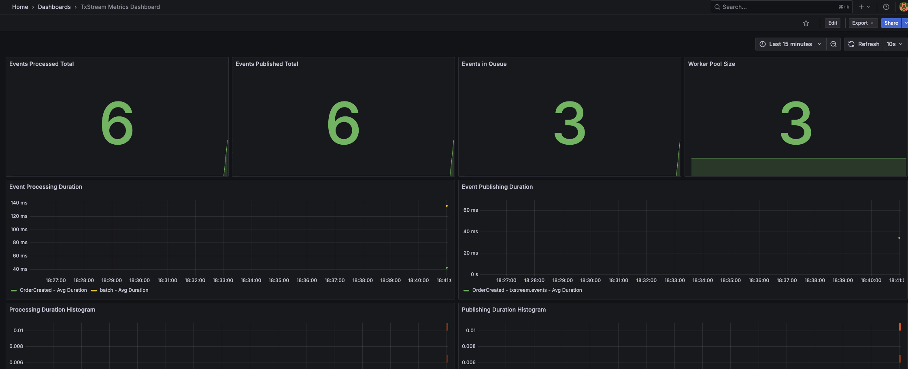
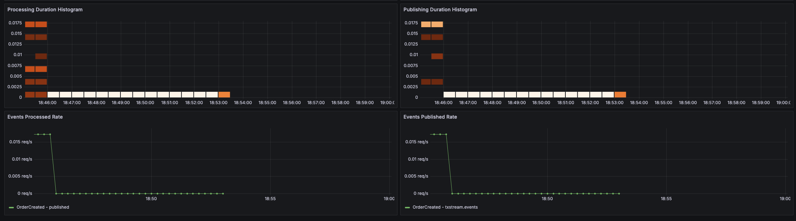
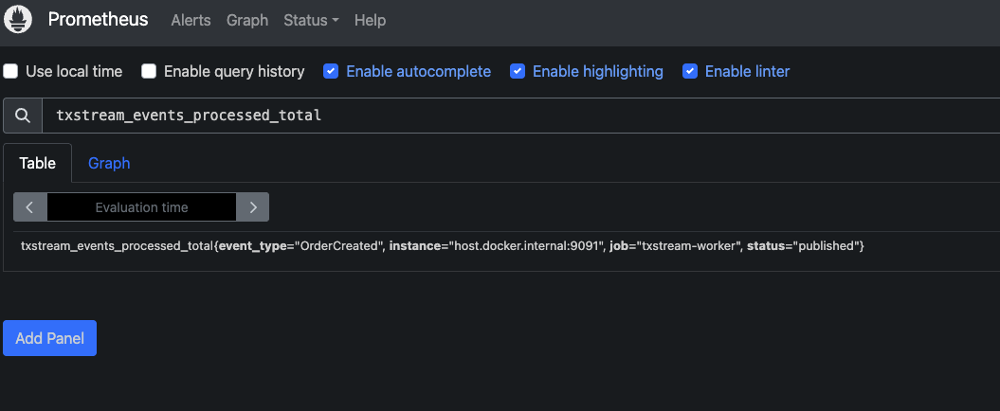
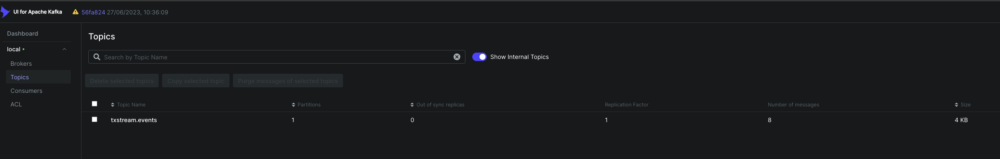
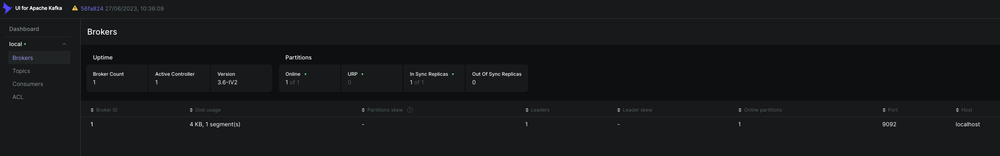
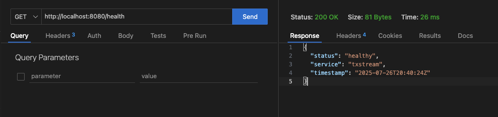
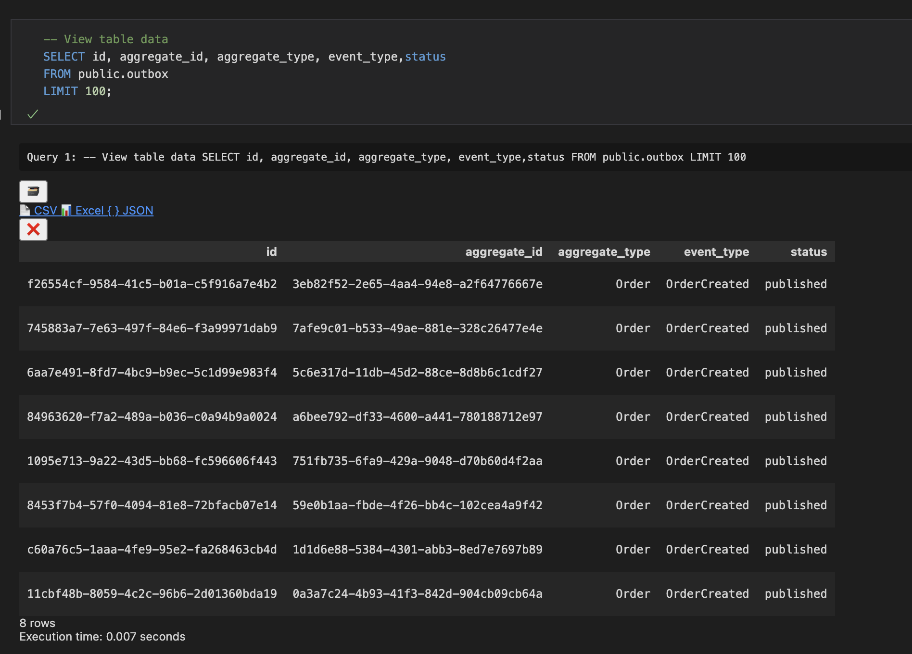
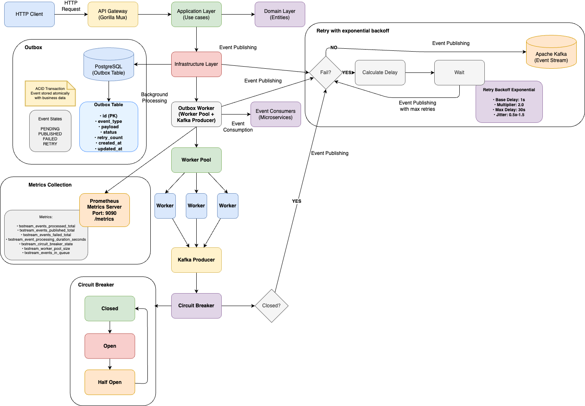
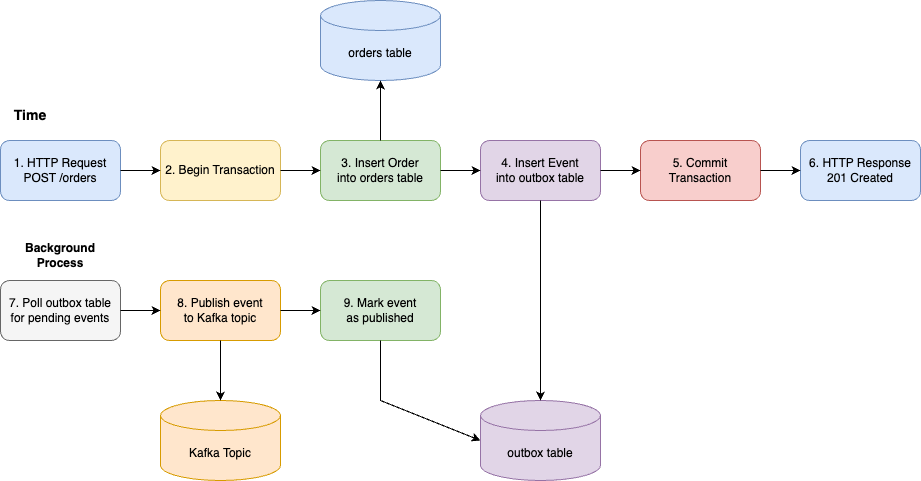

# 🔄 TxStream - Sistema de Eventos com Outbox Pattern

<div align="center">


<div data-badges>
  
  
  
</div>

<div data-badges>
  
  
  
  
  
  
  
  
</div>
</div>

O TxStream é um sistema robusto de processamento de eventos usando o padrão Outbox com Kafka, oferecendo uma solução completa para arquiteturas de microserviços:

✔ **Outbox Pattern** com transações ACID garantindo atomicidade entre pedidos e eventos

✔ **Circuit Breaker** inteligente para prevenção de falhas em cascata no Kafka

✔ **Retry Exponencial** com jitter para tentativas inteligentes de reconexão

✔ **Worker Pool** com processamento paralelo de eventos usando WaitGroup e channels

✔ **Observabilidade completa** com Prometheus, Grafana e métricas detalhadas

✔ **Race Condition Protection** usando SELECT FOR UPDATE para consistência

✔ **Kafka UI** para visualização de tópicos e mensagens em tempo real

Desenvolvido com Go, PostgreSQL, Apache Kafka e Sarama, o sistema garante alta performance, resiliência e observabilidade completa para ambientes de produção.

## 🖥️ Como rodar este projeto 🖥️

### Requisitos:

- [Go 1.21+](https://golang.org/doc/install) instalado
- [Docker & Docker Compose](https://docs.docker.com/get-docker/) instalado
- [Java 17+](https://adoptium.net/) (para Kafka UI local)

### Execução:

1. Clone este repositório:

   ```sh
   git clone https://github.com/lorenaziviani/tx_stream.git
   ```

2. Acesse o diretório do projeto:

   ```sh
   cd tx_stream
   ```

3. Instale as dependências:

   ```sh
   go mod download
   ```

4. Configure as variáveis de ambiente:

   ```sh
   cp env.example .env
   ```

   Edite o arquivo `.env` com suas configurações específicas.

5. Inicie todos os serviços com Makefile (recomendado):

   ```sh
   make start-all
   ```

6. Inicie o worker em outro terminal:

   ```sh
   make run-worker
   ```

7. Acesse os serviços:
   - **API**: [http://localhost:8080](http://localhost:8080)
   - **Kafka UI**: [http://localhost:8082](http://localhost:8082)
   - **Grafana**: [http://localhost:3000](http://localhost:3000) (admin/admin)
   - **Prometheus**: [http://localhost:9090](http://localhost:9090)

## 🗒️ Features do projeto 🗒️

🔄 **Outbox Pattern & Consistência**

- **Transação ACID**
  - Criação atômica de pedidos e eventos outbox
  - Rollback automático em caso de falha
  - Isolamento de transações concorrentes
  - Garantia de durabilidade dos dados
- **Worker Pool**
  - Processamento paralelo de eventos
  - Pool limitado com WaitGroup e channels
  - Proteção contra race conditions
  - Idempotência garantida

🚀 **Resiliência & Performance**

- **Circuit Breaker**
  - Estados: CLOSED → OPEN → HALF-OPEN
  - Proteção contra falhas em cascata
  - Transições automáticas baseadas em métricas
  - Fallback com headers informativos
- **Retry Exponencial**
  - Backoff inteligente com jitter
  - Evita thundering herd durante problemas
  - Configuração flexível de delays
  - Limite máximo de tentativas

📊 **Observabilidade Completa**

- **Métricas (Prometheus)**
  - Eventos processados, publicados e falhados
  - Latência de processamento e publicação
  - Estado do worker pool e circuit breaker
  - Eventos na fila de processamento
- **Grafana Dashboards**
  - Visualizações em tempo real
  - Histogramas de performance
  - Alertas configuráveis
  - Métricas de negócio
- **Kafka UI**
  - Visualização de tópicos e mensagens
  - Monitoramento de brokers
  - Análise de consumidores
  - Debug de eventos

🛠️ **Administração & Testes**

- **Comandos Makefile**
  - Inicialização completa do sistema
  - Gerenciamento de serviços
  - Testes automatizados
  - Limpeza de recursos
- **Testing Suite**
  - Testes de integração para transações ACID
  - Testes de falha e rollback
  - Testes de concorrência
  - Cobertura completa de cenários

## 🔧 Comandos de Teste 🔧

```bash
# Rodar todos os testes
make test

# Testes específicos
make test-unit              # Testes unitários
make test-integration       # Testes de integração
make test-coverage          # Testes com cobertura

# Ver todos os comandos disponíveis
make help
```

## 📈 Monitoramento e Dashboards 📈

### Grafana Dashboard

Acesse [http://localhost:3000](http://localhost:3000) com **admin/admin** para ver:

- Contadores de eventos processados e publicados
- Latência de processamento e publicação
- Status do worker pool e circuit breaker
- Eventos na fila de processamento
- Histogramas de performance





### Prometheus Metrics

Acesse [http://localhost:9090](http://localhost:9090) para monitorar:

- Métricas em tempo real do worker
- Targets e endpoints sendo coletados
- Queries customizadas para análise
- Alertas e rules configuradas



### Kafka UI

Acesse [http://localhost:8082](http://localhost:8082) para visualizar:

- Tópicos e mensagens do Kafka
- Status dos brokers
- Análise de consumidores
- Debug de eventos em tempo real





### Health Check

Verifique o status do sistema:



### Outbox Events

Visualize os eventos na tabela outbox:



## 🌐 Endpoints da API 🌐

### Criar Pedido

```bash
POST /api/v1/orders
Content-Type: application/json

{
  "customer_id": "customer-123",
  "order_number": "ORD-001",
  "items": [
    {
      "product_id": "prod-1",
      "product_name": "Produto 1",
      "quantity": 2,
      "unit_price": 75.00
    }
  ],
  "shipping_address": {
    "street": "Rua das Flores",
    "number": "123",
    "city": "São Paulo",
    "state": "SP",
    "zip_code": "01234-567",
    "country": "Brasil"
  },
  "billing_address": {
    "street": "Rua das Flores",
    "number": "123",
    "city": "São Paulo",
    "state": "SP",
    "zip_code": "01234-567",
    "country": "Brasil"
  }
}
```

### Listar Pedidos

```bash
GET /api/v1/orders?limit=10&offset=0
```

### Buscar Pedido por ID

```bash
GET /api/v1/orders/{id}
```

### Health Check

```bash
GET /health
GET /ready
```

## 🏗️ Arquitetura do Sistema 🏗️

<div align="center">

</div>

```
Cliente → API REST → Transação ACID → Outbox Worker → Circuit Breaker → Kafka Producer → Kafka
```

**Fluxo detalhado:**

1. **API REST**: Recebe requisição de criação de pedido
2. **Transação ACID**: Cria pedido e evento outbox atomicamente
3. **Outbox Worker**: Processa eventos pendentes em paralelo
4. **Circuit Breaker**: Protege contra falhas do Kafka
5. **Kafka Producer**: Publica eventos com retry exponencial
6. **Kafka**: Armazena eventos para consumo por microserviços

### Padrão Outbox

<div align="center">

</div>

O padrão Outbox garante que eventos não sejam perdidos mesmo em caso de falha do Kafka, mantendo a consistência dos dados.

## 🚀 Comandos Makefile 🚀

### Sistema Completo

```bash
# Iniciar todo o sistema
make start-all

# Parar todo o sistema
make stop-all
```

### Kafka UI Local

```bash
# Iniciar Kafka UI localmente
make kafka-ui-start

# Parar Kafka UI
make kafka-ui-stop

# Baixar JAR do Kafka UI
make kafka-ui-download

# Limpar arquivos do Kafka UI
make kafka-ui-clean
```

### Desenvolvimento

```bash
# Executar aplicação
make run

# Executar worker
make run-worker

# Compilar projeto
make build

# Executar testes
make test

# Executar migrações
make migrate
```

### Docker

```bash
# Construir imagem
make docker-build

# Executar container
make docker-run
```

## 🧪 Estratégia de Testes 🧪

### Testes de Integração

- **Transação ACID**: Validação de atomicidade entre pedidos e eventos
- **Rollback**: Testes de falha e recuperação
- **Concorrência**: Isolamento de transações simultâneas
- **Integridade**: Consistência de dados entre pedidos e eventos

### Testes Unitários

- **Circuit Breaker**: Estados e transições
- **Retry Exponencial**: Cálculo de delays e jitter
- **Worker Pool**: Processamento paralelo
- **Métricas**: Coleta e exposição de métricas

### Cobertura de Cenários

| Cenário                 | Status | Descrição                    |
| ----------------------- | ------ | ---------------------------- |
| Transação bem-sucedida  | ✅     | Order + OutboxEvent criados  |
| Falha no outbox         | ✅     | Rollback completo            |
| Pedido duplicado        | ✅     | Retorna conflito             |
| Request inválido        | ✅     | Validação antes da transação |
| Transações concorrentes | ✅     | Isolamento garantido         |
| Circuit Breaker         | ✅     | Proteção contra falhas       |
| Retry Exponencial       | ✅     | Tentativas inteligentes      |
| Worker Pool             | ✅     | Processamento paralelo       |

## 📊 Métricas Disponíveis 📊

### Prometheus

- `txstream_events_processed_total` - Total de eventos processados
- `txstream_events_published_total` - Total de eventos publicados
- `txstream_events_failed_total` - Total de eventos que falharam
- `txstream_worker_pool_size` - Tamanho do pool de workers
- `txstream_events_in_queue` - Eventos na fila de processamento
- `txstream_event_processing_duration_seconds` - Duração do processamento
- `txstream_event_publishing_duration_seconds` - Duração da publicação
- `txstream_circuit_breaker_state` - Estado do Circuit Breaker

### Exemplo de Queries

```promql
# Taxa de eventos processados por minuto
rate(txstream_events_processed_total[1m])

# Latência média de publicação (95º percentil)
histogram_quantile(0.95, rate(txstream_event_publishing_duration_seconds_bucket[5m]))

# Estado atual do Circuit Breaker
txstream_circuit_breaker_state

# Eventos na fila por status
txstream_events_in_queue
```

## 📝 API

### 1. **Criar Pedido Simples**

```bash
curl -X POST http://localhost:8080/api/v1/orders \
  -H "Content-Type: application/json" \
  -d '{
    "customer_id": "demo-1",
    "order_number": "ORD-001",
    "items": [{
      "product_id": "prod-1",
      "product_name": "Produto Demo",
      "quantity": 1,
      "unit_price": 100.00
    }],
    "shipping_address": {
      "street": "Rua Demo",
      "number": "123",
      "city": "São Paulo",
      "state": "SP",
      "zip_code": "01234-567",
      "country": "Brasil"
    },
    "billing_address": {
      "street": "Rua Demo",
      "number": "123",
      "city": "São Paulo",
      "state": "SP",
      "zip_code": "01234-567",
      "country": "Brasil"
    }
  }'
```

### 2. **Criar Pedido com Múltiplos Itens**

```bash
curl -X POST http://localhost:8080/api/v1/orders \
  -H "Content-Type: application/json" \
  -d '{
    "customer_id": "customer-demo-2",
    "order_number": "ORD-002",
    "items": [
      {
        "product_id": "prod-2",
        "product_name": "Produto Demo 2",
        "quantity": 1,
        "unit_price": 99.99
      },
      {
        "product_id": "prod-3",
        "product_name": "Produto Demo 3",
        "quantity": 3,
        "unit_price": 15.50
      }
    ],
    "shipping_address": {
      "street": "Av Demo",
      "number": "456",
      "complement": "Sala 10",
      "city": "Rio de Janeiro",
      "state": "RJ",
      "zip_code": "20000-000",
      "country": "Brasil"
    },
    "billing_address": {
      "street": "Av Demo",
      "number": "456",
      "complement": "Sala 10",
      "city": "Rio de Janeiro",
      "state": "RJ",
      "zip_code": "20000-000",
      "country": "Brasil"
    }
  }'
```

### 3. **Listar Pedidos**

```bash
# Listar todos os pedidos (padrão: 10 por página)
curl http://localhost:8080/api/v1/orders

# Listar com paginação
curl "http://localhost:8080/api/v1/orders?limit=5&offset=0"

# Listar segunda página
curl "http://localhost:8080/api/v1/orders?limit=5&offset=5"
```

### 4. **Buscar Pedido por ID**

```bash
curl http://localhost:8080/api/v1/orders/550e8400-e29b-41d4-a716-446655440000
```

### 5. **Buscar Pedido por Número**

```bash
curl http://localhost:8080/api/v1/orders/number/ORD-001
```

### 6. **Health Check**

```bash
# Verificar se a aplicação está funcionando
curl http://localhost:8080/health

# Verificar se está pronto para receber requisições
curl http://localhost:8080/ready
```

### 7. **Exemplo de Resposta de Sucesso**

```json
{
  "id": "550e8400-e29b-41d4-a716-446655440000",
  "customer_id": "demo-1",
  "order_number": "ORD-001",
  "status": "pending",
  "total_amount": 100.0,
  "currency": "BRL",
  "items": [
    {
      "id": 1,
      "product_id": "prod-1",
      "product_name": "Produto Demo",
      "quantity": 1,
      "unit_price": 100.0,
      "total_price": 100.0
    }
  ],
  "shipping_address": {
    "street": "Rua Demo",
    "number": "123",
    "city": "São Paulo",
    "state": "SP",
    "zip_code": "01234-567",
    "country": "Brasil"
  },
  "billing_address": {
    "street": "Rua Demo",
    "number": "123",
    "city": "São Paulo",
    "state": "SP",
    "zip_code": "01234-567",
    "country": "Brasil"
  },
  "created_at": "2024-01-15T10:30:00Z",
  "updated_at": "2024-01-15T10:30:00Z"
}
```

### 8. **Exemplo de Erro de Validação**

```json
{
  "error": "validation error: customer_id is required"
}
```

### 9. **Exemplo de Erro de Pedido Duplicado**

```json
{
  "error": "order with number ORD-001 already exists"
}
```

## 🤝 Contribuição 🤝

1. Fork o projeto
2. Crie uma branch para sua feature
3. Commit suas mudanças
4. Push para a branch
5. Abra um Pull Request

## 📄 Licença 📄

Este projeto está sob a licença MIT. Veja o arquivo [LICENSE](LICENSE) para mais detalhes.

## 💎 Links úteis 💎

- [Go Documentation](https://golang.org/doc/)
- [GORM Documentation](https://gorm.io/docs/)
- [Apache Kafka](https://kafka.apache.org/documentation/)
- [Sarama Go Client](https://github.com/Shopify/sarama)
- [Prometheus](https://prometheus.io/docs/)
- [Grafana](https://grafana.com/docs/)
- [Outbox Pattern](https://microservices.io/patterns/data/transactional-outbox.html)
- [Circuit Breaker Pattern](https://martinfowler.com/bliki/CircuitBreaker.html)
